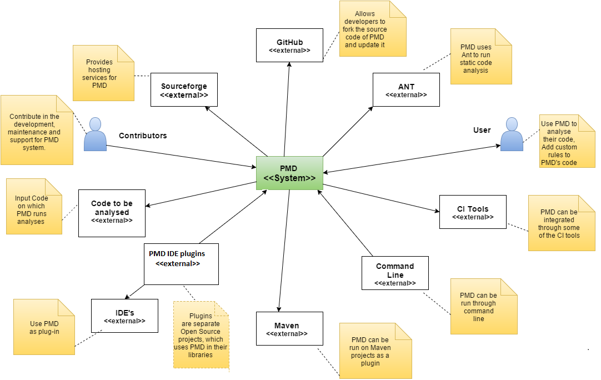

#Context View of PMD

The scope definition for PMD includes the following capabilities [1]:

* It should find common programming flaws (like unused variables, empty catch blocks, unnecessary object creation, and so forth).
* It should support many common languages (currently supporting Java, JavaScript, PLSQL, Apache Velocity, XML, XSL).
* It includes CPD, the copy-paste-detector. CPD should be able to find duplicated code in as many languages as possible (currently supporting Java, C, C++, C#, PHP, Ruby, Fortran, JavaScript, PLSQL, Apache Velocity, Ruby, Scala, Objective C, Matlab, Python, Go).
* It should support the ability to write custom rules (currently possible to write rules either in Java or XPath). 
* It should be able to integrate with IDEs and common tools (currently supports JDeveloper, Eclipse, JEdit, JBuilder, BlueJ, CodeGuide, NetBeans/Sun Java Studio Enterprise/Creator, IntelliJ IDEA, TextPad, Maven, Ant, Gel, JCreator, and Emacs). [2] [3] [4][5]

The scope also defines the key requirements that characterize what the system must do.

External entities on which PMD depends and their responsibilities are as follows:

* Users: They use PMD to find bugs in their code. They also contribute to PMD as they can add custom rules to PMD as per their needs.

* Contributors: They add new languages and rules to PMD. They also maintain and update the system.

* Code to be analysed : PMD scans source code directly to find the flaws

* IDEs' PMD Plugins : These are separate Open Source projects, which uses PMD in their libraries and provide integration of PMD with IDEs.

* IDEs: They use the plug-ins and after integration, they can run PMD to find bugs directly on their repositories. [5]

* Command line: PMD can be run through command line. In this case, the following languages are supported - Java, Ecmascript (JavaScript), JSP, PLSQL, Vm (Apache Velocity), Xml and Xsl. [6]

* Ant: PMD can use Ant to run a set of static code analysis rules on some Java source code files and generate a list of problems found. [2]

* Maven: PMD can be run on Maven projects as a plugin. [3] 

* Continuous Integration tools: PMD can be integrated through some of the CI tools that exist now, like Hudson, Continuum. [4]

* SourceForge: It provides hosting services for PMD. [7]

* GitHub: It allows contributors to fork the source code of PMD and update it. [8]

Context view diagram of PMD is:

#Bibliography

[1] http://pmd.github.io/pmd-5.3.4/index.html

[2] https://pmd.github.io/pmd-5.3.4/usage/ant-task.html

[3] http://www.javavillage.in/maven-setup-for-pmd-cpd.php

[4] https://pmd.github.io/pmd-5.3.4/usage/ci-plugins.html

[5] https://pmd.github.io/pmd-5.3.4/usage/integrations.html

[6] https://pmd.github.io/pmd-5.3.4/usage/running.html

[7] http://sourceforge.net/projects/pmd/

[8] https://github.com/pmd/pmd
