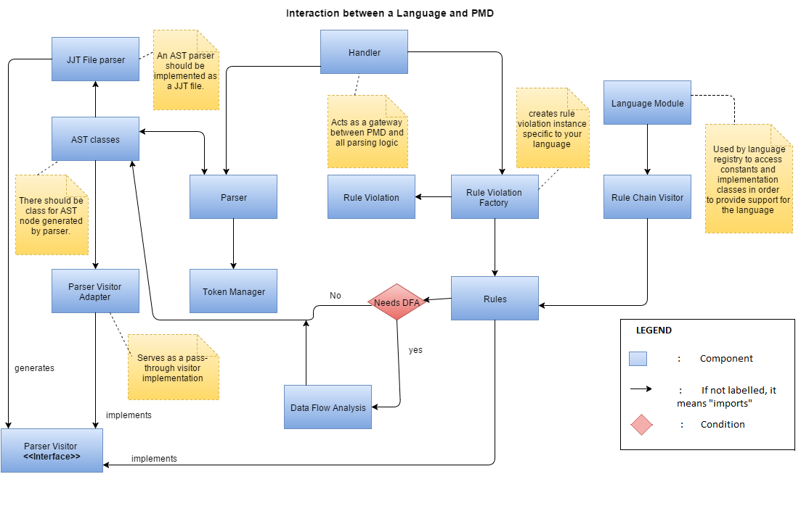
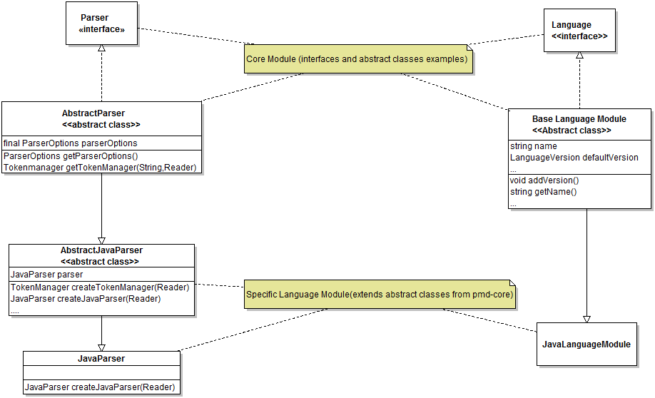
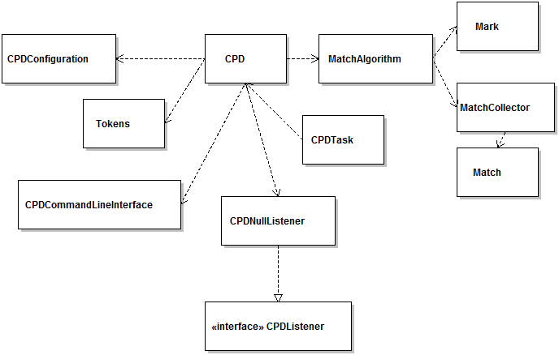

#Functional View of PMD#

The concerns we address in the Functional View are:

1. Functional Capabilities
2. External Interfaces
3. Internal structures
4. Functional design philosophy 

##Functional Capabilities##
PMD's primary functions are:

1. Static Source Code Analyzer - It finds common programming flaws like unused variables, empty catch blocks, unnecessary object creation, and so forth. [1]

2. Copy Paste Detector - Finds duplicate code within projects. This can be run independently of the source code analyzer.

3. Support for multiple languages - As a static source code analyzer, it supports Java, JavaScript, PLSQL, Apache Velocity, XML and XSL. As a copy paste detector, it supports Java, C, C++, C#, PHP, Ruby, Fortran, JavaScript, PLSQL, Apache Velocity, Ruby, Scala, Objective C, Matlab, Python and Go.

##Internal Structures##
**Working of PMD as a static source code analyzer:**

PMD doesn't read the source code directly. It uses a JavaCC generated parser to parse the source code and produces an AST (Abstract Syntax Tree). [2] A rule is called whenever any type that it is interested in is encountered by PMD.

PMD checks source code against rules and produces a report. [3] 

Following is the functional model, which shows interactions between PMD internal interfaces.Boxes and lines representation is used to showcase the interactions. In order to make the  view more abstract,clear and useful,the low-level details (i.e. how the interfaces and abstract classes in pmd-core are implemented or extended in pmd-language) are omitted in the following diagram.The objects shown are not the actual physical aspects of the system but used to present a high-level interaction,hence the reason for not using component diagram in presenting the view.

Every object(blue box) shown in the above diagram is a high-level representation of interactions between two major modules i.e. language module and pmd-core module. The class diagram(shown for only two components) given below shows that how the internal interfaces between these two modules interact with each other.

**Working of PMD as a Copy Paste Detector:**

Currently PMD uses the Karp-Rabin string matching algorithm to detect duplicate code. [4] We delve into the benefits of its use in the Information View.  CPD can be run either through Ant or through the command line. 

**Below we show the steps to run CPD through Ant.**

1. When we run through Ant, we call upon the CPDTask class. While running through Ant, you are required to specify a minimum token count (a positive integer indicating the minimum duplicate size), an output file (if not specified, output will be to console) and at least one input file. You can additionally specify report format (default is text, options include XML and CSV), source code language (default is Java, other choices include Ecmascript, Ruby etc.), encoding scheme and the ability to ignore literals and identifiers. 

2. Files are tokenized, if duplicates over the minimum token count are found they are stored and reported (the bulk of this processing is done within the CPD class), the report is rendered in the desired output format and total analysis time is reported. 

**Below we show the steps to run CPD through the command line.**

1. To run through the command line, we call upon the CPD class. We are required to specify a minimum duplicate size and the source directory. Optional parameters are source code language, encoding style, report format (either XML or CSV), size of Java memory you wish to allot to the task and the ability to check sources located in different directories. 

2. The source code is tokenized and converted to a Hash Set. This is because the Karp-Rabin algorithm speeds up the process of string matching by matching the hash values of strings instead of the strings themselves. During tokenization in the Tokenizer class, you can choose to set boolean properties such as enabling or disabling skipping of blocks like a pre-processor or configure patterns blocks that will be skipped during matching. 

3. Tokens are sent to the MatchAlgorithm class. 

4. Matches are compared within the MatchCollector class. First a pairwise collection of all maximal matches are stored. Matches are then checked and rejected if the match is “too small” or if it is too close together to matter. If not, the match is reported. The difference value is compared against the given minimum token count

5. Files in the directory to be analyzed are opened recursively in the CPD class. Exceptions are raised if duplicate files, non-available files or symlinks are encountered and these are not processed to test for matches. A list of all matches is also stored in the CPD class.

The following class diagrams are meant to clarify how CPD works.

Basic high level class diagram showing the interaction between pmd-core module's CPD and pmd-lang module's CPD:

Class diagram to demonstrate how CPD works through command line:

Class diagram to demonstrate how CPD works through Ant:

**New RuleSet Addition in PMD:**

There are two different ways through which rules can be added to a language in PMD [2]:

Using Java

1) Create a new Java class that extends the abstractRule class of that particular language. For e.g., “net.sourceforge.pmd.lang.plsql.rule.AbstractPLSQLRule” for PLSQL.

2) Add the rule to a ruleset XML file and fill in the elements and attributes. The path for the ruleset XML file can be found under Resources. For e.g., for Java, path is “/pmd/pmd-java/src/main/resources/rulesets/java”.

3)Create a “RuleViolation” (as per the AST pattern, illustrates the problem), and put it in the Report, which is attached to the “RuleContext”

Using XPath Expression

1) XPath engine is integrated into PMD, so now we can write rules as XPath expressions.

2) We'll need to set the class attribute in the rule definition to net.sourceforge.pmd.lang.rule.XPathRule.
     
**Handling new languages in PMD:**

Interaction of a language with PMD can be considered as an interaction of the PMD core module with a specific language module. Support for new languages is added by adding new modules to the codebase.  

##External Interfaces
As per R&W, data, event and control flows between the system and external systems can be categorised as External Interfaces. We can consider the addition of support for new languages to PMD as a flow between the system (PMD) and external systems (new languages). 

**To include a new language into PMD’s existing structure using Java as a reference [5]**:

1) Implement an AST parser as a JJT file for the new language. [/pmd/pmd-java/etc/grammar/Java.jjt](https://github.com/pmd/pmd/blob/master/pmd-java/etc/grammar/Java.jjt)

2) There should be a class for every AST node which your parser can generate. [/pmd/pmd-java/src/main/java/net/sourceforge/pmd/lang/java/ast/ASTAndExpression.java](https://github.com/pmd/pmd/blob/master/pmd-java/src/main/java/net/sourceforge/pmd/lang/java/ast/ASTAndExpression.java)

3) Compile your parser using an ANT script.

4) Using TokenManager interface, create a class for managing tokens in your language. [/pmd/pmd-java/src/main/java/net/sourceforge/pmd/lang/java/JavaTokenManager.java](https://github.com/pmd/pmd/blob/master/pmd-java/src/main/java/net/sourceforge/pmd/lang/java/JavaTokenManager.java)

5) Create a PMD parser adapter which extends AbstractParser class.It creates a tokenmanager instance for new language and returns a root AST node using this tokenmanager instance. (e.g. [/pmd/pmd-java/src/main/java/net/sourceforge/pmd/lang/java/Java13Parser.java](https://github.com/pmd/pmd/blob/master/pmd-java/src/main/java/net/sourceforge/pmd/lang/java/Java13Parser.java))

6) Create a rule violation factory instance specific to the new language. ([/pmd/pmd-java/src/main/java/net/sourceforge/pmd/lang/java/rule/JavaRuleViolationFactory.java](https://github.com/pmd/pmd/blob/master/pmd-java/src/main/java/net/sourceforge/pmd/lang/java/rule/JavaRuleViolationFactory.java))

7) Create a version handler which will interact with the rule violation factory, parser adapter and the Visitor Starter to dump the text representation of AST into a writer. (e.g. [/pmd/pmd-java/src/main/java/net/sourceforge/pmd/lang/java/Java14Handler.java](https://github.com/pmd/pmd/blob/master/pmd-java/src/main/java/net/sourceforge/pmd/lang/java/Java14Handler.java))

8) Create a rule chain visitor which will check if the rule is a parser visitor type of rule and will execute the visitor. ([/pmd/pmd-java/src/main/java/net/sourceforge/pmd/lang/java/rule/JavaRuleChainVisitor.java](https://github.com/pmd/pmd/blob/master/pmd-java/src/main/java/net/sourceforge/pmd/lang/java/rule/JavaRuleChainVisitor.java))

9) Add a new entry for the language in the net.sourceforge.pmd.lang.Language enum and the another one in net.sourceforge.pmd.lang.LanguageVersion enum.

10) PMD recognizes your language now. Create an abstract rule class for the new language by extending the AbstractRule class and implementing the parservisitor interface. ([/pmd/pmd-java/src/main/java/net/sourceforge/pmd/lang/java/rule/AbstractJavaRule.java](https://github.com/pmd/pmd/blob/master/pmd-java/src/main/java/net/sourceforge/pmd/lang/java/rule/AbstractJavaRule.java))

11) Create rules by extending the class generated in step #10.

12) In order to test the new rules, create a unit test for every rule set created for new language.

**User interaction with PMD**:

1) A user can run PMD via Command Line on both UNIX based operating systems (using script called “run.sh” inside the bin/ directory) and Windows (using PMD’s starter batch file pmd.bat in the bin subdirectory). But, this medium is not user-friendly. [6]

2) PMD can run as an ANT task. Memory usage was an issue while using it as ANT task, but it has been reduced significantly starting with PMD 4.0. However, on very large projects, the Ant task may still fail with a OutOfMemoryError. This can be prevented by increasing the maximum memory usable by ant.[7]

3) Apache Maven PMD Plugin: This plugin allows a user to automatically run the PMD code analysis tool on his/her maven project's source code and generate a site report with its results. It also supports the CPD distributed with PMD.[8] 

4) PMD as IDE Plugins: PMD can be integrated with IDEs as plugins. These integrations are separate Open Source projects, which uses PMD in their libraries. Most plugins include the PMD jar file, which has the rulesets inside it. So even though the rulesets parameter that some plugins use looks like a filesystem reference, it’s really being used by a getResourceAsStream() call to load it out of the PMD jar file. Currently, PMD has been integrated with Eclipse, NetBeans, IntelliJ IDEA, Emacs, Gel etc.[9]

##Functional Design Philosophy##
PMD adheres to a stable functional design philosophy. It is partitioned into a PMD Core modules and separate language modules. 

The PMD Core is further partitioned into packages which separately take care of CPD, utilities (for tasks such as iterating through files, finding files in a directory etc.), dead code detector, language utilities (for tasks such as implementations of the Parser interface, discovering the Language Version of a source file etc.) and other such base modules which the language modules would all need to use. 

There are separate packages for all the language modules (such as PMD-Fortran, PMD-CPP, PMD-Java etc.) These are well-partitioned into testing and source packages. Within both the source and testing packages, we have classes to deal with different rulesets and how files should be tokenized for the Copy Paste Detector. 

With its stable hierarchical structure, PMD exhibits **strong coherence**, **high cohesion** and **low coupling** which makes it very readable and easily maintainable. It exhibits a **consistent design** since the primary structure is repeated within smaller substructures i.e. a Java language module will have the same structure as a Go language module with only the details of the implementation classes differing. There is a good level of separation of concerns since there is no particular “God element” in the architecture. Each implementation class deals with different aspects of functions to be performed. 

It is easily extensible since if we ever want to add a new language, we simply add another module and if we want to add new rules, we can implement them within the PMD Core. The instructions to add new languages and new rules are also very clear. 

The architecture is not generic. Implementation classes deal with different languages and hence they must have different functionalities. A generic architecture would not serve in the case of PMD either so this architecture makes sense. It is a simple system to understand as it can be read from a top-level and functionalities understood without having to understand all the low-level implementation details.

Overall, PMD presents a very well-designed software architecture. 

##References##
[1] http://pmd.github.io/
[2] http://pmd.sourceforge.net/pmd-5.1.0/howtowritearule.html
[3] http://pmd.sourceforge.net/pmd-5.1.0/howitworks.html
[4] http://pmd.sourceforge.net/pmd-4.3.0/cpd.html
[5] http://pmd.sourceforge.net/pmd-5.1.0/new-language.html
[6] https://pmd.github.io/pmd-5.4.0/usage/running.html
[7] https://pmd.github.io/pmd-5.4.0/usage/ant-task.html
[8] http://maven.apache.org/plugins/maven-pmd-plugin/index.html
[9] https://pmd.github.io/pmd-5.4.0/usage/integrations.html#
