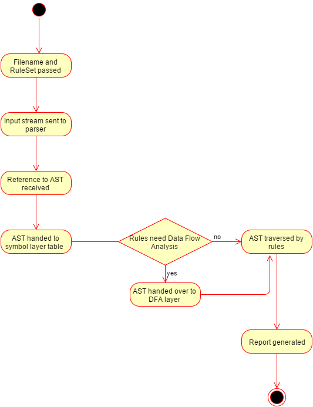
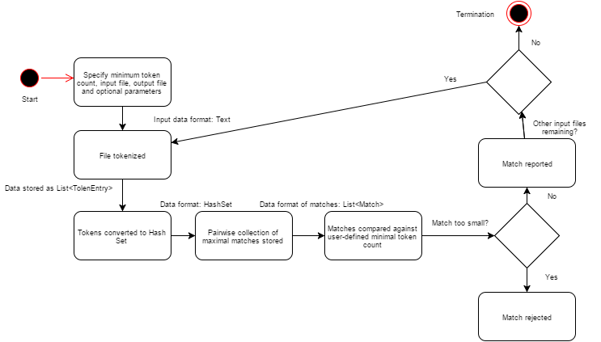

#Information View 

A traditional information view, targeted towards developers, addresses how an architectural model translates into real-world databases, archival systems, information interfaces and how these can guarantee consistency and integrity of data. 

PMD is a system where data is not stored and does not need to be archived or retrieved. Consequently, in the Information View (targeted to stakeholders of the Developer class) we focus on: 
Data flow throughout the system
Implementation details such as data structures used and how they support information processing
Process life-cycle 

An interesting aspect of the PMD system is that there is no data flow between the source code analyzer and the copy-paste detector (CPD) parts of it. 

##Data Flow

####Static Source Code Analyzer

Information Flow Model analyzing dynamic flow of information between PMD and an external user:

The above flow can be described as follows[1]:

1) Filename and Rule Set are passed to PMD.

2) InputStream to the file is handed off by PMD to be sent off to JavaCC-generated parser.

3) Reference to Abstract Syntax Tree(AST) is received by PMD from the parser.

4) The AST is handed off by PMD to the symbol table layer, which builds scopes, finds declarations, and find usages.

5) If any rules need data flow analysis, the AST is handed over by PMD to the DFA(Data Flow Analysis) layer for building control flow graphs and data flow nodes.

6) Each Rule in the RuleSet gets to traverse the AST and check for problems. The rules can also poke around the symbol table and DFA nodes.

7) The Report is now filled with RuleViolations, and those get printed out in XML or HTML or whatever

###Implementation Details

In PMD, an AST parser for a language is implemented, ideally as a jjt file. This parser converts the incoming source code to an Abstract Syntax Tree and passes it as a reference for the static source code analyzer part of PMD. This in turn sends it to the SymbolTable layer as shown above. Each rule in the ruleset traverses through this tree to look for problems. [1][2]

The interaction between the parser and PMD can be shown as the following class diagram:

####CPD

The interaction between the CPD part of PMD and the external user is:

PMD uses the provided source code directly and finds the duplicate code using Karp-Rabin string matching algorithm. 
If CPD detects duplicated source code, it will exit. This behavior has been introduced to ease CPD integration into scripts or hooks, such as SVN hooks.[3]

##Bibliography
[1]https://pmd.github.io/pmd-5.4.0/customizing/howitworks.html
[2]https://pmd.github.io/pmd-5.4.0/customizing/new-language.html
[3]https://pmd.github.io/pmd-5.4.0/usage/cpd-usage.html
