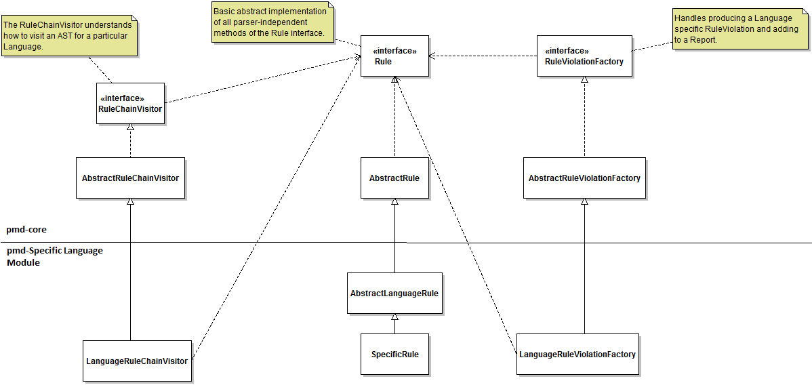
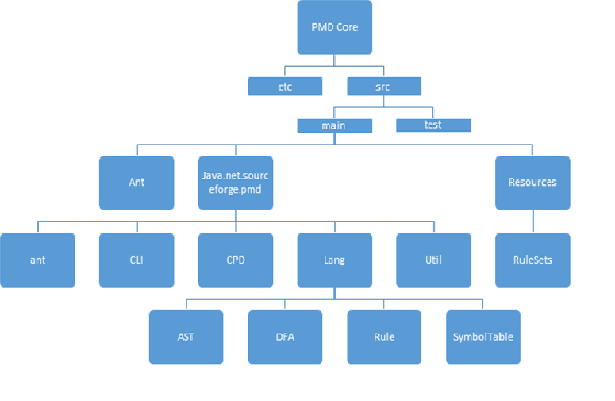
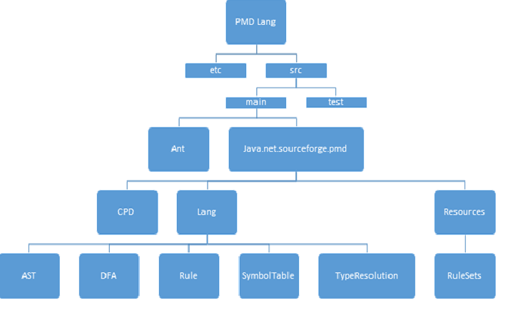

#Development View
In our Development View, we have addressed the concerns of:

* Module Dependencies and Organization
* Commonalities in the Design Model
* Codeline Organization

##Module Dependencies and Organization
 PMD is  comprised of two major modules - PMD-Core and PMD-SpecificLanguage (e.g. PMD-Java). PMD follows a standardized format while adding new language modules. All language modules added are independent of each other and have the same level of dependency on the PMD-Core. This helps to maintain clean modularization approach. The following diagram shows the common dependencies between PMD-Core and PMD-SpecificLanguage:

The PMD-Core Module consists of core packages like lang, CPD etc. and other APIs which provide support for implementation of  specific languages. Lang package in PMD-Core provides interfaces which support PMD-SpecificLanguage module in the process of parsing input stream and applying rules on the input by referring AST nodes created by the parser. CPD package in PMD-Core provides interfaces which are extended by the SpecificLanguage packages to implement copy-paste-detector functionality. CPD package is independent of all other packages present in both the PMD-Core and SpecificLanguage modules.

The Dependency Structure Matrix of PMD is given below. As we can see, there are no cycles in the DSM and it is a lower triangular matrix which means that there are no cyclic dependencies and that therefore, it has a good architecture. 

##Common Design Model

In this section, we cover the commonalities seen across elements in PMD. As previously discussed, PMD has a highly consistent logical design and any new update/addition must follow the same design to maintain consistency. Here we identify and specify some of the common processes in PMD.

####Parsing of source files[1]:

* All the languages that are implemented by the static source code analyzer should have a parser implementation which can convert the source code to AST.
* Standard folder structure should be followed for parser implementation.
* A class should be generated for each AST Node possible through the parser.
* A parent AST class should be ideally included for all of these classes.

Standard Software Components [1]:

* The parser for a language should ideally be implemented as a JJT file. Any other parser implementation can also be used as long as they can convert an input stream into AST.
* JJT file should be placed in the following path: pmd-lang -> etc -> grammar
* An Ant script should be used to compile JJT files into classes.

Standard Design:

Following is the class diagram of the parser implementation, that should be followed as a standard for any language.

	
####Definition of Rules [2]:
	
To implement the static source code analyzer for a given language (i.e. Java, C++ etc.), rules must be defined. It is important that these rules follow a similar design in order to make any update comprehensible. While a source code analyzer can be developed for source code written in any language, the rules themselves must be written either as a Java class or as an XPath Expression.

Standard Software Components:

* Rules should be written either as a Java class or as an XPath Expression (inclusion of jaxen.jar and saxpath.jar allows XPath Rules) [3].
* Every rule should be added to either an existing or a new ruleset XML file.
* For XPath rules, “class” attribute in ruleset XML file should be set to “net.sourceforge.pmd.lang.rule.XPathRule”.
* Java rules should be placed in the following path: pmd-lang->src->main->java->net->sourceforge->pmd->lang->java->rule

Standard Design:

Following is the class diagram representing the relationship between the PMD-core and PMD-SpecificLanguage modules in context of rules. All the languages implementing the static source code analyzer follow the same structure as represented in the diagram.

The "RuleChainVisitor" is used to generate a list of nodes with their node types for the input source file. It is also used to evaluate the rule type (x-path rule or java class rule) and then execute appropriate logic for visitation of the generated indexed nodes by that rule.

##The Codeline Model
We have developed 2 models which demonstrate the directory structure used to hold the files: one for the PMD-Core module and one for the PMD-SpecificLanguage module. For ease of readability, we have represented the codeline model as a Hierarchical Tree instead of a UML diagram.

An interesting aspect of the code structure is that if a language only implements the CPD (for example: Fortran, GO), then it doesn’t need the static source code analyser related folders such as etc (which contains the jjt file for the language), lang (which implements the language for static source code analyser) and resources (which contains the rulesets).

Also, "TypeResolution" is an optional directory that will be present in the PMD-SpecificLanguage module, if any rule of that language needs TypeResolution. TypeResolution, in this context, means using the bytecode manipulation library ASM to parse classfile dependencies. This reduces false positives. [4]

No common approach to the overall build process is mentioned, but Maven being is used for compilation.[6] Any update or change request by PMD developers is done by submitting patches or feature requests to Github.[4]

The common approach to the testing process is that after a rule is written, a series of unit tests are created in order to reduce the number of false positives that might be reported due to the rule. These are stored within the respective lang module for which the test is being developed i.e. pmd-java has a test for the brace-matching rule within the class /pmd/pmd-java/src/test/java/net/sourceforge/pmd/lang/java/rule/braces/BracesRulesTest.java.

There does not appear to be any common approach to the release process, with new releases being created once enough bugfixes or patches have accumulated. However, the version and release information are updated after every release within the file src/site/markdown/overview/changelog.md according to a standardized template. If any new release changes were created in a separate release-branch, these are then merged into the master branch.[5]

##References
[1] https://pmd.github.io/pmd-5.4.0/customizing/new-language.html
[2] https://pmd.github.io/pmd-5.4.0/customizing/howtowritearule.html
[3] http://sourceforge.net/p/pmd/discussion/188194/thread/9187a49e/?limit=25#4323/e129/4bb9
[4] http://www.infoq.com/news/2007/07/pmd
[5]https://pmd.github.io/pmd-5.4.0/customizing/pmd-release-process.html
[6]https://pmd.github.io/pmd-5.4.0/customizing/compiling.html
