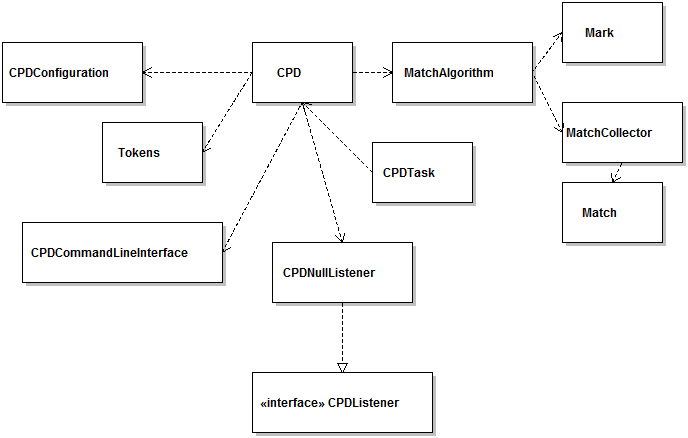
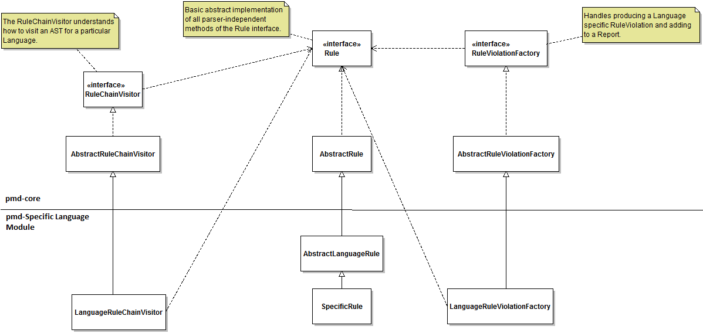

#Functional View of PMD#

This view is mainly targeted towards the stakeholder’s class-Developers. The concerns we address in the Functional View are:

1. Functional Capabilities
2. External Interfaces
3. Internal structures
4. Functional design philosophy 

The above concerns are chosen to help stakeholders understand PMD’s functionality using a top-bottom approach (main functional elements to internal structures). We also discuss the dominant architectural style and some of the design patterns followed in PMD.

##Functional Capabilities##
PMD's primary functions are:

1. Static Source Code Analyzer - It finds common programming flaws like unused variables, empty catch blocks, unnecessary object creation, and so forth. [1]

2. Copy Paste Detector - Finds duplicate code within projects. This can be run independently of the source code analyzer.

3. Support for multiple languages - As a static source code analyzer, it supports Java, JavaScript, PLSQL, Apache Velocity, XML and XSL. As a copy paste detector, it supports Java, C, C++, C#, PHP, Ruby, Fortran, JavaScript, PLSQL, Apache Velocity, Ruby, Scala, Objective C, Matlab, Python and Go.

##Internal Structures##
**Working of PMD as a static source code analyzer:**

PMD doesn't read the source code directly. It uses a JavaCC generated parser to parse the source code and produces an AST (Abstract Syntax Tree). [2] A rule is called whenever any type that it is interested in is encountered by PMD.

PMD checks source code against rules and produces a report. [3] 

Following is the functional model, which shows the static structure of PMD. In order to make the  view more abstract, clear and useful,the low-level details (i.e. how the interfaces and abstract classes in pmd-core are implemented or extended in pmd-language) are omitted in the following diagram.The objects shown are not the actual physical aspects of the system but used to present  high-level dependencies, hence the reason for not using component diagram in presenting the view.

The following table describes the role of individual modules in the diagram:

There are two main modules: pmd-core (which contains the general implementation of a language, general implementation of rules, the main flow of application of rules on an input file to get violations and the main flow for copy-paste detector) and pmd-specific language module (which contains the extension of Language and Rules from core module for that specific language). The interaction between core and specific language modules can be shown as below: 

**Working of PMD as a Copy Paste Detector:**

Currently PMD uses the Karp-Rabin string matching algorithm to detect duplicate code. [4] We delve into the benefits of its use in the Information View.  CPD can be run either through Ant or through the command line. Running CPD via Ant does not affect how CPD will run via command line, and either can be run individually.

**Below we show the steps to run CPD through Ant.**

1. When we run through Ant, we call upon the CPDTask class. While running through Ant, you are required to specify a minimum token count (a positive integer indicating the minimum duplicate size), an output file (if not specified, output will be to console) and at least one input file. You can additionally specify report format (default is text, options include XML and CSV), source code language (default is Java, other choices include Ecmascript, Ruby etc.), encoding scheme and the ability to ignore literals and identifiers.

2. Files are tokenized, if duplicates over the minimum token count are found they are stored and reported (the bulk of this processing is done within the CPD class), the report is rendered in the desired output format and total analysis time is reported.

Class diagram to demonstrate how CPD works through Ant:

**Below we show the steps to run CPD through the command line.**

1. To run through the command line, we call upon the CPD class. We are required to specify a minimum duplicate size and the source directory. Optional parameters are source code language, encoding style, report format (either XML or CSV), size of Java memory you wish to allot to the task and the ability to check sources located in different directories.

2. The source code is tokenized and converted to a Hash Set. This is because the Karp-Rabin algorithm speeds up the process of string matching by matching the hash values of strings instead of the strings themselves. During tokenization in the Tokenizer class, you can choose to set boolean properties such as enabling or disabling skipping of blocks like a pre-processor or configure patterns blocks that will be skipped during matching.

3. Tokens are sent to the MatchAlgorithm class.

4. Matches are compared within the MatchCollector class. First a pairwise collection of all maximal matches are stored. Matches are then checked and rejected if the match is “too small” or if it is too close together to matter. If not, the match is reported. The difference value is compared against the given minimum token count

5. Files in the directory to be analyzed are opened recursively in the CPD class. Exceptions are raised if duplicate files, non-available files or symlinks are encountered and these are not processed to test for matches. A list of all matches is also stored in the CPD class.

Class diagram to demonstrate how CPD works through command line:

Basic high level class diagram showing the interaction between pmd-core module's CPD and pmd-lang module's CPD:

**New Rule Addition in PMD:**

There are two different ways through which rules can be added to a language in PMD [2]:

Using Java

Rules can be added by creating a java class extending the abstract rule class of that language. Static structure of a “SpecificRule” class is as follows:

Using XPath Expression
	
XPath engine is integrated into PMD, so rules can be written as XPath expressions. Parsing of source file into AST basically gives a tree-like structure similar to XML and hence, it can be queried with XPath to find a pattern.

Each rule must be added to either an already existing or a new ruleset file. Rulesets are xml files which contain references to a set of similar rules. Path to Ruleset files needed are passed through command line while running PMD.[6]

**Handling new languages in PMD:**

The PMD-Core module interacts with specific language modules to “handle” new languages. Support for new languages is added by adding new modules to the codebase.[5] The basic interfaces and abstract classes for definition of a language are defined in the core module. Any new language should implement those interfaces and extend the abstract classes to be identifiable by PMD. The process to add a new language can be described using the following activity diagram:

##External Interfaces
As per R&W, data, event and control flows between the system and external systems can be categorised as External Interfaces. In the following section “User Interaction”, we will discuss various media (external systems) which can be used to interact with PMD. These media request PMD to analyze source files by transferring the control flow to PMD.

**User interaction with PMD**:

1) A user can run PMD via Command Line on both UNIX based operating systems (using script called “run.sh” inside the bin/ directory) and Windows (using PMD’s starter batch file pmd.bat in the bin subdirectory). But, this medium is not user-friendly. [6]

2) PMD can run as an ANT task. Memory usage was an issue while using it as ANT task, but it has been reduced significantly starting with PMD 4.0. However, on very large projects, the Ant task may still fail with a OutOfMemoryError. This can be prevented by increasing the maximum memory usable by ant.[7]

3) Apache Maven PMD Plugin: This plugin allows a user to automatically run the PMD code analysis tool on his/her maven project's source code and generate a site report with its results. It also supports the CPD distributed with PMD.[8] 

4) PMD as IDE Plugins: PMD can be integrated with IDEs as plugins. These integrations are separate Open Source projects, which uses PMD in their libraries. Most plugins include the PMD jar file, which has the rulesets inside it. So even though the rulesets parameter that some plugins use looks like a filesystem reference, it’s really being used by a getResourceAsStream() call to load it out of the PMD jar file. Currently, PMD has been integrated with Eclipse, NetBeans, IntelliJ IDEA, Emacs, Gel etc.[9]

##Functional Design Philosophy##
PMD adheres to a stable functional design philosophy. It is partitioned into a PMD Core module and separate language modules. 

The PMD Core is further partitioned into packages which separately take care of CPD, utilities (for tasks such as iterating through files, finding files in a directory etc.), dead code detector, language utilities (for tasks such as implementations of the Parser interface, discovering the Language Version of a source file etc.) and other base modules which the language modules would all need to use. 

There are separate packages for all the language modules (such as PMD-Fortran, PMD-CPP, PMD-Java etc.) These are well-partitioned into testing and source packages. Within both the source and testing packages, we have classes to deal with different rulesets and how files should be tokenized for the Copy Paste Detector. 

With its stable hierarchical structure, PMD exhibits **high cohesion** and **low coupling** which makes it very readable and easily maintainable.
**High cohesion** is made evident by the package structure used in PMD, shown by the following diagram:

The diagram shows the inner details of two main packages present in PMD Specific language module (e.g. Java in this case). It shows that the files relevant to “lang” module and “CPD” module are added in their respective packages. These packages have no interaction with each other which supports the separation of files present in these packages. All the other packages follow the similar structure. 

**Low coupling** is supported by the use of Visitor interfaces. Visitor interfaces allows to change the operations (e.g. rules) without changing the target(e.g. AST) on which the rules will be applied. 

PMD exhibits a **consistent design** since the primary structure is repeated within smaller substructures i.e. a Java language module will have the same structure as a Go language module with only the details of the implementation classes differing. There is a good level of separation of concerns since there is no particular “God element” in the architecture. Each implementation class deals with different aspects of functions to be performed. 

It is easily extensible since if we ever want to add a new language, we simply add another module. If we want to add new rules, we can implement them within the PMD Core. The instructions to add new languages and new rules are also very clear. 

The architecture is not generic. Implementation classes deal with different languages and hence they must have different functionalities. A generic architecture would not serve in the case of PMD either so this architecture makes sense. It is a simple system to understand as functionalities can be understood just from the top-level without having to understand all the low-level implementation details.

Overall, PMD presents a very well-designed software architecture. 

##Architectural Style and Design Patterns##
The most dominant style as observed in PMD is “**Pipes and Filters**”. We have already seen the static model in “Internal Structures” concern. Now, let us examine the behavioral model to see how this style actually maps to the architecture of PMD.

* In the diagram, each component is acting as a filter by reading the input, applying transformation and writing output stream. 
* Each asynchronous call is a pipe, which reads the output from the previous filter and writes it as an input to the next filter. 
* The output object type from each filter (which is also an input to the next filter) is also mentioned on the asynchronous calls. 
* The main interactions as shown in the diagram can be explained as following:
 	  * User inputs the information (source files, rulesets to be applied, report format needed).
	  * These details are converted into PMDConfiguration object and passed on to the Renderers (component that deals with report creation) and Parser (component that will parse the source files into AST).
	  * Parser converts the source file into Abstract Syntax Tree and creates it as a “Node” object and pass it to the SymbolTable component.
	  * SymbolTable updates the “Node” object, checks if it is necessary to pass it to Data Flow Analysis(DFA) component and then pass the updated “Node” object to either DFA or directly to Rulesets.
	  * DFA component attaches data flow nodes to the incoming “Node” object and pass it to the Rulesets component.
	  *  Rulesets component takes the incoming “Node” object, traverses the AST with the rules needed and generate “Violations” object, which is sent to Renderers.
	  * Renderers component has already created a report as per the PMDConfiguration object received. The incoming “Violations” object write into that report, which is finally generated for the user.

####Design Patterns
Various design patterns have been used in PMD to solve general design problems:

* **Visitor Pattern**:
Visitor's primary purpose is to abstract functionality that can be applied to an aggregate hierarchy of "element" objects [10]. “AbstractRuleChainVisitor” class in core-module in PMD is extended by different languages to reuse the common functionality for all the languages as well as implement their own specific functionalities.

* **Strategy Pattern**:
The strategy pattern (also known as the policy pattern) is a design pattern that enables an algorithm’s behavior to be selected at runtime [11]. PMD supports multithreading and this should be selected in PMDConfiguration. There are two different algorithms for multithread processing and monothread processing: “MonoThreadProcessor” and “MultiThreadProcessor”. The algorithm to be run is decided at runtime based upon the configuration provided.

##References##
[1] http://pmd.github.io/
[2] http://pmd.sourceforge.net/pmd-5.1.0/howtowritearule.html
[3] http://pmd.sourceforge.net/pmd-5.1.0/howitworks.html
[4] http://pmd.sourceforge.net/pmd-4.3.0/cpd.html
[5] http://pmd.sourceforge.net/pmd-5.1.0/new-language.html
[6] https://pmd.github.io/pmd-5.4.0/usage/running.html
[7] https://pmd.github.io/pmd-5.4.0/usage/ant-task.html
[8] http://maven.apache.org/plugins/maven-pmd-plugin/index.html
[9] https://pmd.github.io/pmd-5.4.0/usage/integrations.html#
[10]https://sourcemaking.com/design_patterns/visitor
[11]https://en.wikipedia.org/wiki/Strategy_pattern
