#Conformance Checking
We have used the “Class Visualizer” tool to generate class diagrams from the current PMD codebase to prove the credibility of diagrams used in Architecture Description. We have also used DSM(generated using IntelliJ Idea) and code snippets to further verify our architecture.

##Notation used in class diagrams generated by the Class Visualizer
**Solid lines** - show “uses”-association.

**Dashed Lines** - show “uses”-dependency.

**Greyed out text boxes** - show built in classes.

**Dashed lines connecting red boxes** - show “throws”-dependency.It is used to represent exception handling.
	

##Verification of Static structure  
###Static Source Code Analyzer

####Parser
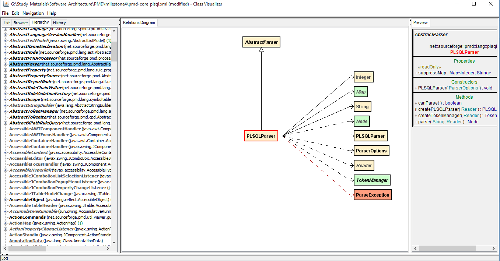

**Figure 1: Parser implementation captured using class visualizer**

Above diagram illustrates the parser  implementation for a language module (e.g. PLSQLParser).PLSQL parser extends the abstract parser class present in PMD-core module. Right column in the diagram shows all the methods and fields present in class. Return type of parse method validates the description provided for parser in the following diagram. The diagram used in functional view is shown in Figure 2 and corresponds to Figure 1(generated by Class Visualizer) 

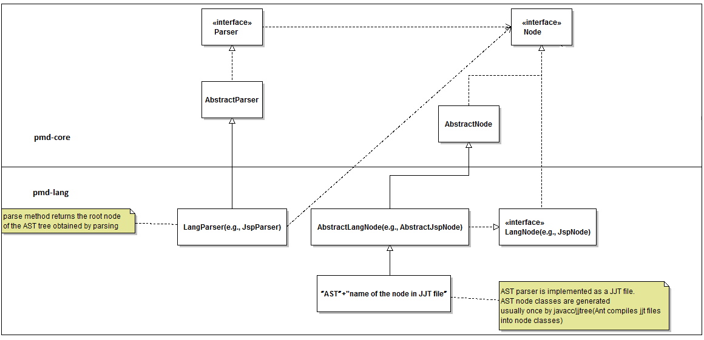

**Figure 2: Parser implementation used in AD**

####Language
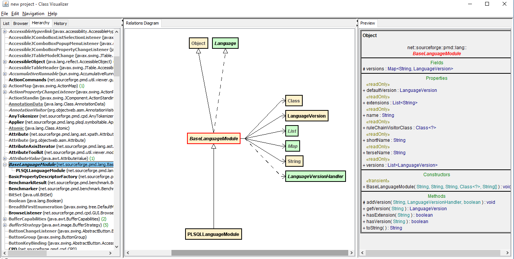

**Figure 3: Interaction between PMD-Language module and PMD-core captured using class visualizer**

This diagram validates the statement -”every language module extends the base language module present in PMD-core” used in Functional View of PMD.

####Handler

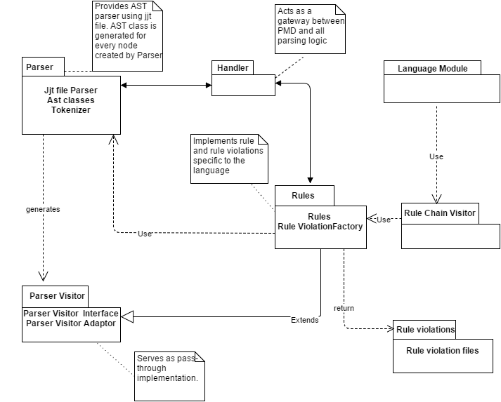

**Figure 4: Static structure diagram of PMD used in AD**

The above diagram describes  Handler as a gateway for the  parsing logic in PMD.It shows the association of Handler with both Parser and Rules. 
The following  diagram supports the association of handler with RuleViolationFactory. But it shows that the relationship between Parser and Handler is not  “is a “ type of relation rather it is a  dependency relation. 

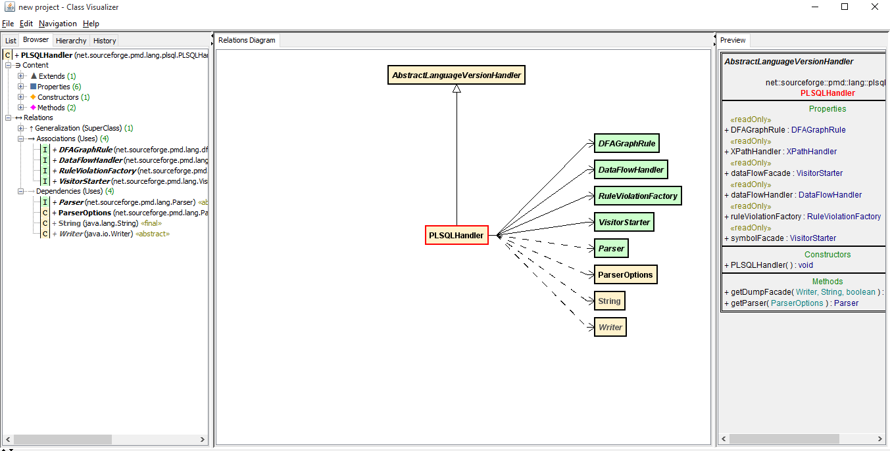

**Figure 5: Interaction of Handler with Parser and Rules**

####Rules

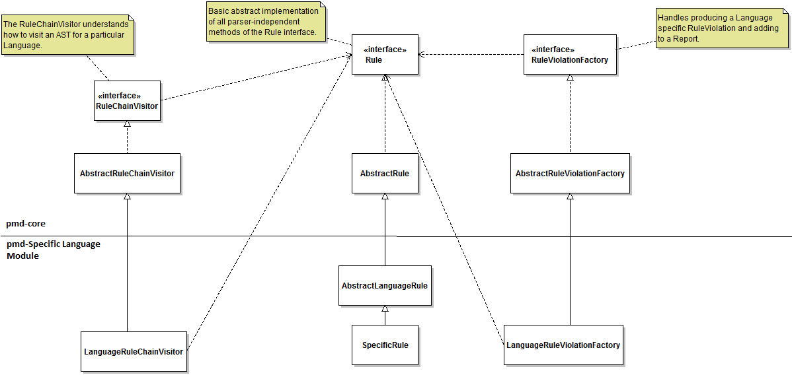

**Figure 6: Interaction between Rules, RuleViolationFactory and RuleChainVisitor**

Figure 6 from functional view shows how “Rule” class interacts with RuleViolationFactory and RuleChainVisitor. It describes that RuleChainVisitor is used to visit all the AST nodes in order to apply rules on the input source code.

Figure 7 shows the association between rules and the visitor. RuleChainVisitor creates a map containing a node and the list of that type of node. VisitAll() method uses this list and ruleContext to visit all those nodes and apply rules accordingly. This conforms to the relationship shown in Figure 6.

Figure 8 shows the interaction between rules and RuleViolationFactory, which corresponds to the relationship shown in Figure 6. It illustrates that RuleViolationFactory uses handler to choose the languageVersion and return a RuleViolation instance for a specific language.

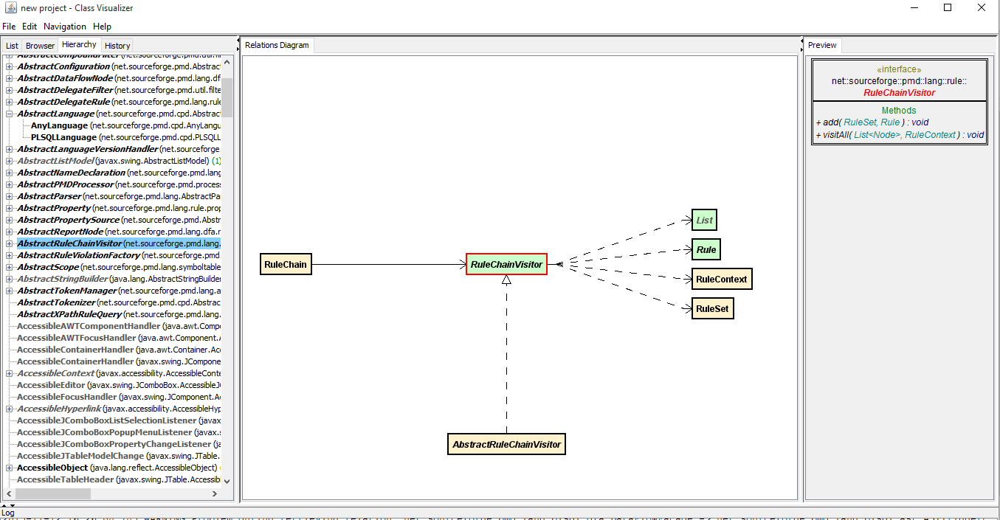

**Figure 7: Class Diagram of RuleChainVisitor captured using Class Visualizer**

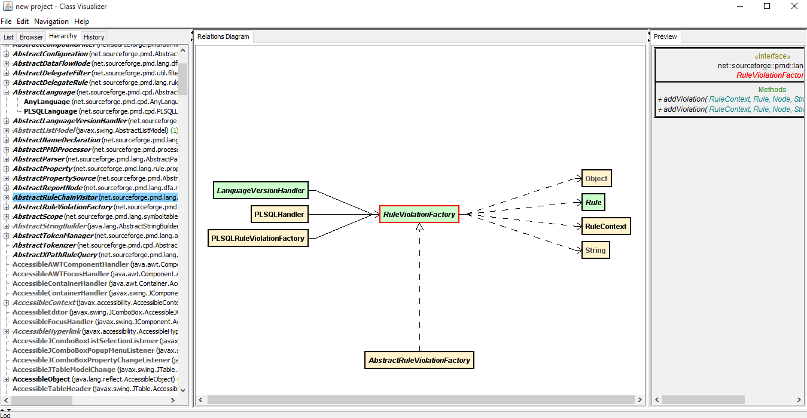

**Figure 8: Class Diagram of RuleViolationFactory captured using Class Visualizer**

####Dependency Analysis

We have mentioned in functional view and ESD that PMD exhibits modularity, low coupling and consistent design. The following DSM proves these properties. As we can see, there are no cycles in the DSM and it is a lower triangular matrix which means that there are no cyclic dependencies(hence, low coupling) and therefore, it has a consistent architecture. Also, the division into pmd-core module and pmd-ExampleLanguage modules is clearly evident here, hence proving modularity.

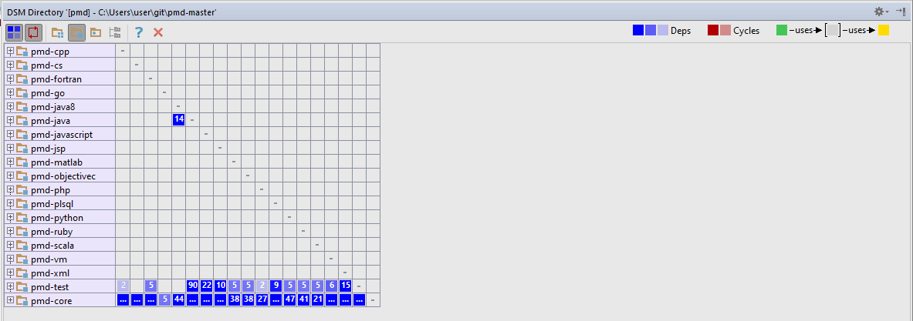

**Figure 9: Dependency Structure Matrix of PMD generated by IntelliJ**

###CPD

As we can see, the class dependency diagram generated by the Class Visualizer software (Figure 11) mirrors the manually created class diagram (Figure 10) of the structure of CPD. Thus it validates our previous assumptions about how the CPD module is structured.  

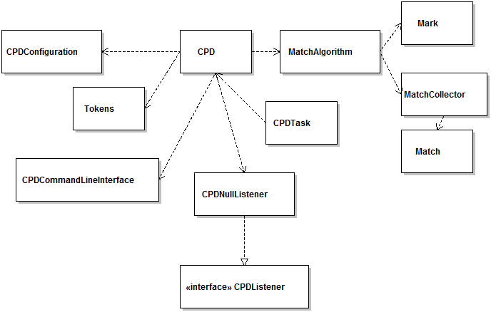

**Figure 10: Manually create CPD Class Diagram**

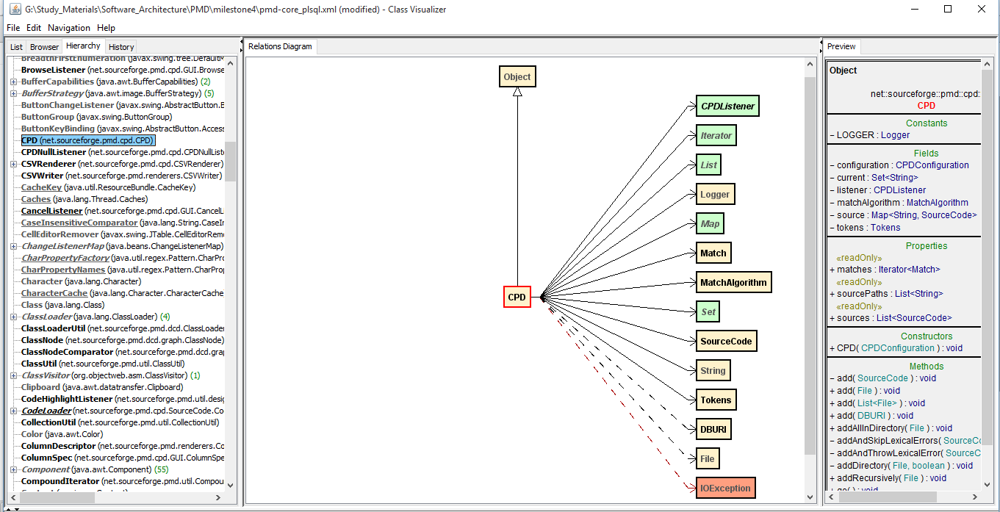

**Figure 11: CPD Class Dependency Diagram generated by Class Visualizer**

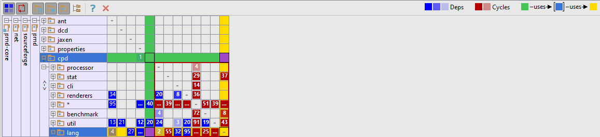

**Figure 12: Dependency Structure Matrix of CPD generated by IntelliJ**

Figure 12 serves to illustrate our previous point that the CPD module does not depend on the static source code analyzer part of CPD (i.e. the lang submodule). 

##Verification of Dynamic Structure

In the functional view, Figure 13 is used to prove “Pipes and Filters” architectural style. It also represents the dynamic structure of PMD as the diagram depicts the process of application of rules on source file to generate violations. Figure 14 is used in information view to show the dynamic flow of information between PMD and external user. It also corresponds to the same process as shown in Figure 13.

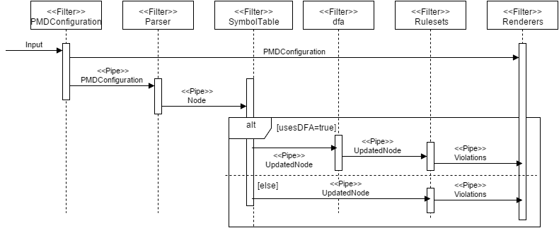

**Figure 13: Dynamic Structure of PMD as shown in AD**

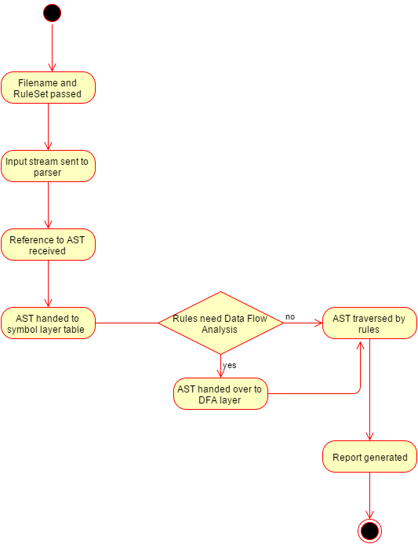

**Figure 14: Information flow of PMD as shown in AD**

Figure 15 is a code snippet from [SourceCodeProcessor](https://github.com/pmd/pmd/blob/master/pmd-core/src/main/java/net/sourceforge/pmd/SourceCodeProcessor.java) class of pmd-core, which proves the process depicted in figures  13 and 14. The “processSource” method of mentioned class clearly corresponds to the sequence shown in AD, starting from the part where source code is provided to parser(parse method) and parsed tree is saved as “Node”, then providing to symbol table layer(symbolFacade method), checking if dfa(usesDFA method) and type resolution(usesTypeResolution method) are required and finally, applying the rulesets(ruleSets.apply method).

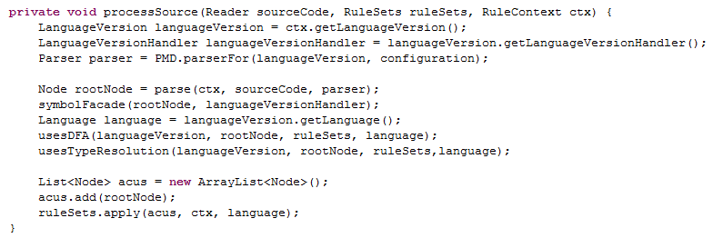

**Figure 15: Code snippet depicting PMD analysis : SourceCodeProcessor.java**

