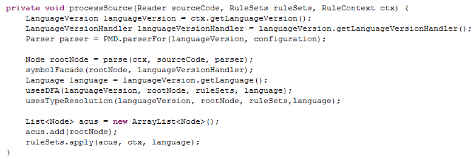

##Introduction to PMD
PMD is a popular open-source project (released under the BSD and LGPL licenses and the Apache License 2.0). It functions both as a static source code analyzer and as a copy-paste detector.

An introduction to a software project should begin with the project’s complete and un-acronymized name. Accordingly, we present the software project PMD to our readers - which while it sounds like an acronym is actually not. Various backronyms have been suggested for PMD (including “Programs of Mass Destruction”), none of which seem to have stuck.

A static source code analyzer is a tool which can analyze source code and produce as output a set of programming flaws inside it (instances of inefficient code such as dead code, empty code blocks, suboptimal code etc.). It does this by means of rulesets which can be written by any contributor.

A copy-paste detector detects duplicate instances of code within a project. It takes a set of source code files as input and produces a report listing all matches above a certain user-defined threshold of match.

PMD is currently one of the most popular Software Development tools on Sourceforge, with over 30,000 weekly downloads. While PMD has its own website (http://pmd.github.io/), there are currently no wikis or other sources of documentation available online that make PMD’s inner workings clear. We hope that by developing a thorough documentation of PMD’s architecture, internal structures and use, we have made some impact on any future audience interested in learning more about PMD.

The documentation we have developed elaborating on PMD’s architecture is targeted towards developers, who might be interested in contributing to or understanding more about PMD. They are assumed to have previous software development experience and a familiarity with technical terms, but with no particular knowledge of PMD or static source code analyzers.

###What influenced the design of PMD?
While documenting PMD, we came across three constraints that we feel strongly influenced the original developers and therefore the subsequent architecture of PMD:

1. The support of as many languages, that source code could be written in, as possible

2. Support for the addition of new rules and languages

3. The availability of as many rules as possible to detect possible bugs and bad practices in the source code

###Organizational Structure of the PMD Project
The PMD team is comprised mainly of Members and Contributors. Members have direct access to the source of a project and actively evolve the code-base. Contributors improve the project through submission of patches and from suggestions to the Members. The number of Contributors to the project can be unbounded [1].
PMD also has several enterprise-level contributors (different from individual-level contributors) such as:

1. AE for the JSP integration and especially for writing the JSP grammar [2].

2. RefactorIT for letting their software be used free-of-charge on PMD code [2].

3. Cenqua for providing PMD a free Clover license [2].

The PMD team has only 20 active developers having commit privileges to the Github repository (out of 38 total contributors listed).
##PMD as a Static Source Code Analyzer
**What is a static source code analyzer?**

In simple terms, static code analysis is the analysis of a software program without actually executing it. PMD, in the role of a static source code analyzer, scans source code and looks for common programming flaws like unused variables, empty catch blocks, unnecessary object creation and so forth [3].  PMD supports the following languages: Java, JavaScript, PLSQL, Apache Velocity, XML and XSL.

PMD’s biggest advantage is that it can be easily extended to add a new language. Also, it is easy to add new rules to PMD (to detect new types of flaws in an already existing language).

**How does PMD work as a static source code analyzer?**

PMD uses a JavaCC generated parser to parse the source code and produces an AST (Abstract Syntax Tree). [4] JavaCC is a parser generator and lexical analyzer written in Java. An AST is a tree representation of the abstract syntactic structure of source code written in a programming language. Each node of the tree denotes a construct occurring in the source code. [5]  

A rule is called whenever any node that it is interested in is encountered by PMD.

PMD checks source code against rules and produces a report. [6]

**What to expect in the following sections?**

We will first see how users can interact with PMD. Then, we will discuss the system’s static structure in detail and then we will delve into its dynamic structure, by explaining the process of application of rules on input source files. We’ll derive the dominant architectural style used through PMD’s structure. Later, we will go through evolvability of PMD by discussing addition of new languages and addition of new rules and rulesets.

##PMD as a Copy-Paste Detector
The Copy-Paste Detector (CPD) uses the Karp-Rabin algorithm for matching strings to detect duplicate code. The Karp-Rabin algorithm is frequently used to detect instances of plagiarism since it compares the hash values of strings instead of the strings themselves. This causes it to have a much lower running time for multiple pattern search than other string-matching algorithms.

Most of the code needed to run the CPD is contained within the PMD-Core module. In addition, every language for which the copy-paste detector can detect duplicate code, contains a CPD module. For example, copy-paste detection is enabled for C++. Code required to run static source code analysis and copy paste detection for C++ is contained within the pmd-cpp module. The pmd-cpp module thus contains a cpd sub-module.

**Figure 9: File structure of the pmd-cpp module**

The following diagram demonstrates the interaction between the PMD-Core module’s CPD and a PMD-Lang module’s CPD (where PMD-Lang refers to modules such as pmd-cpp or pmd-java etc., which implement the CPD):

**Figure 10: Interaction between PMD-Core module's CPD and a PMD-Lang module's CPD**

Support for new languages can be added by adding a cpd submodule within the language’s PMD-Lang module.

###How is PMD run?

####How is the Static Source Code Analyzer run?
There are various media using which a user can choose to interact with PMD. These are discussed as follows:

**Using Command Line**

PMD can run on both UNIX based operating systems (using the script called “run.sh” inside the bin/ directory) and Windows (using PMD’s starter batch file pmd.bat in the bin subdirectory) via the Command Line. In both kind of systems, the user will have to pass the source file location, report format needed and the ruleset file/s (rules which he/she wants to apply on the input).

However this medium is not user-friendly. [8]

**As an ANT task**

The required parameter for PMD, when running as an ANT task is “rulesetfiles” to specify the Ruleset/s to be used. A nested element “formatter” specifies the format and fileName for the report to be generated. The user also has an option to view the generated violations on console.

Memory usage was an issue while using it as ANT task, but it has been reduced significantly starting with PMD 4.0. However on very large projects, the Ant task may still fail with an OutOfMemoryError. This can be prevented by increasing the maximum memory usable by Ant. [9]

**Apache Maven PMD Plugin**

This plugin allows a user to automatically run the PMD code analysis tool on his/her maven project's source code and generate a site report with its results. It provides the user with the option to change ruleset files by updating “maven.pmd.rulesets” property. It also supports the Copy-Paste Detector distributed with PMD. [10]

**PMD as IDE Plugins**

PMD can be integrated with IDEs as plugins. These integrations are separate Open Source projects, which uses PMD in their libraries. Most plugins include the PMD jar file, which has the rulesets inside it. So even though the rulesets parameter that some plugins use looks like a filesystem reference, it’s really being used by a getResourceAsStream() call to load it out of the PMD jar file. Currently, PMD has been integrated with Eclipse, NetBeans, IntelliJ IDEA, Emacs, Gel etc. [11]

Any new IDE can be integrated with PMD by creating a new project and using PMD’s jar file in it. It shows that PMD’s architecture is designed to facilitate integration evolution.

####How is the Copy Paste Detector run?
CPD can be run either from the command line or Apache Ant. The following Activity Diagram clarifies how a user can run the CPD:

**Figure 1: CPD Activity Diagram**

The user is required to specify the following parameters:
1. a minimum token count (a positive integer indicating the minimum duplicate size)
2. an output file (if not specified, output will be to console)
3. at least one input file

In addition, the user can also specify optional parameters:
1. report format (default is text, options include XML and CSV)
2. source code language (default is Java, other choices include Ecmascript, Ruby etc.)
3. encoding scheme
4. choice to ignore literals and identifiers
5. size of Java memory the user wishes to allot to the task
6. ability to check sources located in different directories

###Static Structure

Two main parts of PMD are PMD-Core and PMD-ExampleLanguageModule. Here “PMD-ExampleLanguage” represents a module for any language, which has been implemented in PMD (such as pmd-cpp for the C++ language or pmd-java for the Java language).

The “Core” contains the general implementation of a language(the basic interfaces and abstract classes which each language should implement/extend), general implementation of rules and the main flow of application of rules on source code to get violations. The “ExampleLanguage” contains the extension of Language and Rules from “Core” for that specific language. This use of “Generalization Pattern” facilitates evolution.

The following diagram represents the static structure of PMD. Each of the module in the diagram consists of elements present in both “Core” and “ExampleLanguage”. Solid lines show association between two elements of the diagram.

**Figure 2: Static Structure of PMD**

####Language Module

The main purpose of this module is to make PMD recognize the language. In other words, this registers the language with PMD. The basic implementation is included in “Core” while the language-specific implementation (which inherits the basic implementation) is included in “ExampleLanguage”.

####Handler

Handler or to be more specific, “LanguageVersionHandler” is used to obtain the classes necessary for the analysis of the input source files of that particular language (or version of that language, if more than one version exists for it). For example, “pmd-java” has different handlers for different versions such as Java13Handler, Java14Handler etc. Thus, we can say that the handler acts as a gateway between a language in PMD and all parsing logic. It means that it checks for the language version of the source file and select appropriate parsing logic and rulesets(provided as input), that can be applied on that particular version.

Similar to other modules, the basic implementation of “Handler” is included in “Core” while the language-specific implementation (which inherits the basic implementation) is included in “ExampleLanguage”.

####Parser

**JavaCC (Java Compiler Compiler)** - JavaCC is very popular tool  which is used for tree building purposes along with its other functionalities which are not relevant to the context of PMD.

**JJT** - JJT is a preprocessor of JavaCC. JJT provides the necessary source code needed in JavaCC for generating parse trees (i.e. ASTs ). By default, JJT provides a Java interface node which must be implemented by all the parse nodes. PMD uses .jjt file, which contains information about all possible nodes that can be present in a language’s Abstract Syntax Tree, to construct trees from the input source code.

The output generated by compiling .jjt file is run through JavaCC in order to generate a parser interface. This interface is then extended by every PMD-ExampleLanguage. Parser interface provides reference of the root node generated by .jjt file.

**AST** classes are a group of classes generated by using .jjt file. JJT file contains a node for every statement parsed in the source code and AST classes need to be created for every node present in .jjt file with the name “AST +the name of node in jjt file”.

These classes are generated only once by the JavaCC and can be updated or modified as per requirements. Use of AST structure as an input for the “Rule application” process provides PMD with a single point of definition for the incoming data (source code in form of AST). This helps PMD contain change and makes it easier to separate concerns and hence, facilitates evolution.

The interaction of the parser and AST classes\interfaces present in the PMD core and PMD ExampleLanguage are shown in the following diagram.

**Figure 3: Interaction of the parser and AST classes in PMD**

####Rules
Rules are a set of constraints  which are applied on the input source i.e. AST nodes and the compliance between the input and rules  is tested. If the input violates any rules then it is added to the Rule Violation file.This file contains all the instances where rules are not followed by the input source code.

The interaction between Rules and rule violations is handled by the RuleViolationFactory which generates a rule violation whenever the input source does not comply with any of the constraints mentioned in the rules. Further, rules can be grouped by using a RuleSet. A RuleSet in an XML file which contains a set of similar rules. Those rules are grouped together so that they can  be applied at once e.g. rules checking for unused local variable, unused private fields, duplicate imports etc. A language module can have one or more RuleSets. The path to the RuleSet files needs to be passed while running PMD through command line.PMD rules can be written using two different ways- XPATH query and Java classes.The conversion of source code into AST nodes enables the users  to write rules without waiting for the implementation of any feature requests raised in the past.Details of implementing rules are discussed in the following sections. 
 
 The interaction between Rules and the RuleViolationFactory is shown in the following diagram:

**Figure 4: Interaction between Rules and RuleViolationFactory in PMD**

####RuleChainVisitor
This visitor is used to used to visit all the applicable nodes when a rule is applied. It is the responsibility of RuleChainVisitor to differentiate between the two different types of rules- Rules written in Java and Rules in XPath.

In order to execute the rules written in Java, ParserVisitor is needed. So whenever a RuleChainVisitor comes across a rule of type parser visitor, it executes the ParserVisitor. If the rule is written in XPath, it is directly executed.
 
RuleChainVisitor provides a method named IndexNodes which generates a map of “node type” and “a list of all nodes of that type”. This method returns a map which is further used to visit the nodes while applying rules.

####RuleViolation
Rule violations are captured in a file and this is produced as an output while using PMD as a source code analyzer. The format of output file is mentioned in Renderers. User can change the format as per their convenience. The formats commonly used are HTML and XML.

###Dynamic Structure

The main elements in PMD are languages and their parsers, rules and application of rules on input source files. We have already discussed the role of individual modules in the “Static Structure” section. Now we will look into how these modules interact with each other to perform static code analysis.

####Static Source Code Analysis

We discussed how languages, their parsers and their rules are created. Now comes the part where we will see how these rules are applied on the input source files to get violation report. This part also shows that the dominant architectural style used in PMD is “Pipes and Filters”.

The following sequence diagram summarizes the analysis part of PMD. The diagram has been annotated to show the incorporation of “Pipes and Filter” Architectural Style. 

**Figure 5: PMD as a Pipes and Filter style architecture**

The process depicted in the diagram can be explained as follows
User inputs the location of the source files, rulesets to be applied and report format needed (E.g., CSV, HTML, text etc.) through one of the media used to interact with PMD.

These details are converted into “PMDConfiguration” object and passed on to the Renderers (component that deals with report creation) and Parser (component that will parse the source files into Abstract Syntax Tree).

Parser converts the InputStream of the source file into Abstract Syntax Tree and creates it as a “Node” object and passes it to the SymbolTable component.

SymbolTable updates the “Node” object, and checks if it is necessary to pass it to the Data Flow Analysis (DFA) component. Data-flow analysis is a technique for gathering information about the possible set of values calculated at various points in a computer program.[8] Several rules in PMD require Data Flow Analysis and they are marked. The updated “Node” object is passed to the DFA component only if the required rules need DFA. Otherwise, it is passed directly to Rulesets.

DFA component attaches data flow nodes to the incoming “Node” object and passes it to the Rulesets component.

Rulesets component takes the incoming “Node” object, traverses the Abstract Syntax Tree with the rules needed and generates “Violations” object, which is sent to Renderers.

Renderers component has already created a report in the specified format as per the PMDConfiguration object received. The incoming “Violations” object writes into that report, which is finally generated for the user.

Each component shown in the diagram reads the input, applies needed transformations and at last, generates the output stream for the next step, which is similar to the task of a “Filter”. Thus, they have all been annotated as “Filter”.

The asynchronous calls in the diagram read the output from the previous component and write it as an input to the next component, hence working as “Pipes”. The data format being transferred in those calls are mentioned in the diagram.

Following is a code snippet from PMD which verifies the discussed process.

 
**Figure 6: Code snippet depicting PMD analysis : [SourceCodeProcessor.java](https://github.com/pmd/pmd/blob/master/pmd-core/src/main/java/net/sourceforge/pmd/SourceCodeProcessor.java)**

###PMD as a Copy-Paste Detector
The Copy-Paste Detector (CPD) uses the Karp-Rabin algorithm for matching strings to detect duplicate code. The Karp-Rabin algorithm is frequently used to detect instances of plagiarism since it compares the hash values of strings instead of the strings themselves. This causes it to have a much lower running time for multiple pattern search than other string-matching algorithms.

Most of the code needed to run the CPD is contained within the PMD-Core module. In addition, every language for which the copy-paste detector can detect duplicate code, contains a CPD module. For example, copy-paste detection is enabled for C++. Code required to run static source code analysis and copy paste detection for C++ is contained within the pmd-cpp module. The pmd-cpp module thus contains a cpd sub-module.

**Figure 9: File structure of the pmd-cpp module**

The following diagram demonstrates the interaction between the PMD-Core module’s CPD and a PMD-Lang module’s CPD (where PMD-Lang refers to modules such as pmd-cpp or pmd-java etc., which implement the CPD):

**Figure 10: Interaction between PMD-Core module's CPD and a PMD-Lang module's CPD**

Support for new languages can be added by adding a cpd submodule within the language’s PMD-Lang module.

###Dominant Architectural Style:  Pipes and Filters

As discussed in Fig. 5, “Pipes and Filters” is the dominant architectural style used to design PMD. A static source code analyzer does not need to modify input. In the case of PMD, it just needs to analyze the incoming source file, apply rules on it and generate the violations. These steps are mostly independent of each other and do not need to share states. This supports the use of the mentioned style in PMD.

###How PMD can be evolved?
PMD’s architecture facilitates evolution as it can be easily extended to add new languages as well as new rules in existing languages.

####Implementation of a Language

As discussed, PMD has different “ExampleLanguage” modules for each language and to add a language, a new “ExampleLanguage” needs to be added to the codebase. A language, its parser and its rules are implemented by extending the corresponding implementations in “Core”. We can see here that a common structure is being used for all the languages, which helps PMD to maintain its consistency.

The following activity diagram explains the process of addition of a language as a static source code analyzer.

**Figure 7: Addition of a language to the static source code analyzer**

####Implementation of Rules

Rules can be added to PMD in following two ways[5]:

1. Using Java
2. Using XPath Expression

**Using Java**

Rules can be added by creating a java class extending the abstract rule class of that language. We have already seen the class diagram for a “SpecificRule” in the “Rules” section in “Static Structure”.

Each rule must be added to a new or existing ruleset XML file. The following diagram shows an example of a ruleset file with an added rule:

**Figure 8: A ruleset file with a new added rule**

We can see here that a little code snippet has been included as CDATA as an example of rule violation. This can be seen as a good practice as it will be easier for the user to visualize the flaw.

**Using XPath Expression**

XPath engine is integrated into PMD, so rules can be written as XPath expressions. Parsing of source file into AST basically gives a tree-like structure similar to XML and hence, it can be queried with XPath to find a pattern. As expected, each rule must be added to a new or existing ruleset xml file.

Addition of new rules or rulesets needs very less effort and this has little to no effect on the original architecture of PMD, maintaining the consistency.

Addition of Custom rules can be local or global:
“Local” means if the user needs rule/ruleset just for personal usage, he/she can update a local copy of the codebase and the changes won’t be available for all.
“Global” means new rule/ruleset is requested via feature request or patch and hence will be available for all.

A common approach to testing “rules” is used in PMD. After a rule is written, a series of unit tests are created in order to reduce the number of false positives that might be reported due to the rule. These tests are stored in the “ExampleLanguage” module of that language, i.e. pmd-java has a test for the brace-matching rule within the class. /pmd/pmd-java/src/test/java/net/sourceforge/pmd/lang/java/rule/braces/BracesRulesTest.java.

##Points of Interest in PMD’s architecture

**Modularity** - Modularity in PMD is supported by a well-defined package structure. The source code is partitioned into two main packages - pmd-core and any language module (e.g. pmd-java). Files present in the core module are not dependent on any other files present outside pmd-core package. This structure helps in preventing cyclic dependencies. 

**High Cohesion** - High cohesion means the relevant files/code should be present at the same place. Package structure in PMD favours this condition by putting all relevant files at the same place. e.g. ‘lang’’ subpackage present in pmd-core package contains all the necessary files needed for the conversion of input source code into AST,parsing and applying rules.

**Low Coupling** - Low coupling is supported by the use of Visitor interfaces. Visitor interfaces allows the operations to be changed (e.g. rules) without changing the target (e.g. AST) on which the rules will be applied.

**Consistent Design** - PMD exhibits a consistent design since the primary structure is repeated within smaller substructures i.e. a Java language module will have the same structure as a Go language module with only the details of the implementation classes differing. There is a good level of separation of concerns since there is no particular “God element” in the architecture. Each implementation class deals with different aspects of functions to be performed.

The dominant architectural style followed in PMD is **Pipes and Filters**. This style of architecture supports data flow easily as the main functionality of PMD is strongly connected to data flows between different internal elements of the system. However, the filters in PMD work independently from each other but they cannot be re-ordered i.e. the positions of the filters cannot be changed without compromising the workability of the system.(e.g. Filter 'dfa' cannot work if it is placed before the filter 'SymbolTable' as it would need the input from SymbolTable to work on it.) So, it can be said that PMD possesses a strongly-typed Pipes and Filters style. This makes the architecture **simpler** and easier to understand. It enables the user to easily **reuse** and **maintain** the source code.

##Acknowledgments
We are very grateful to Dr. Martin Robillard and Faiz Khan, without whose insight and guidance this project would not have been possible. We also thank our classmates whose constructive criticism helped us improve the project.

##References
PMD. “The Team.” pmd.github.io. https://pmd.github.io/pmd-5.3.4/team-list.html
PMD. “Credits.” pmd.github.io. https://pmd.github.io/pmd-5.3.4/overview/credits.html
PMD. “Welcome to PMD.” pmd.github.io. http://pmd.github.io/
Sourceforge. “How to write a PMD rule.” pmd.sourceforge.net. http://pmd.sourceforge.net/pmd-5.1.0/howtowritearule.html
Wikipedia. “Abstract syntax tree.” wikipedia.org. https://en.wikipedia.org/wiki/Abstract_syntax_tree
Sourceforge. “How it works.” pmd.sourceforge.net. http://pmd.sourceforge.net/pmd-5.1.0/howitworks.html
Wikipedia. “Data flow analysis.” wikipedia.org. https://en.wikipedia.org/wiki/Data-flow_analysis
PMD. “Running PMD via command line.” pmd.github.io. https://pmd.github.io/pmd-5.4.0/usage/running.html
PMD. “Ant Task Usage”. pmd.github.io. https://pmd.github.io/pmd-5.4.0/usage/ant-task.html
Maven. “Apache Maven PMD Plugin.” maven.apache.org. http://maven.apache.org/plugins/maven-pmd-plugin/index.html 
PMD. “IDE Integrations”. pmd.github.io. https://pmd.github.io/pmd-5.4.0/usage/integrations.html

##Biography

Aprajita: Aprajita is currently pursuing her Masters(Thesis) in Electrical & Computer Engineering (Specialization: Software Engineering) at McGill University. She obtained her Bachelor of Engineering in Electronics & Communication from Visvesvaraya Technological University, Bangalore, India in 2013. She worked as a Software Engineer Analyst for 2 years at Accenture.

Senjuti Kundu: Senjuti is currently pursuing her Masters (Thesis) in Computer Science at McGill University. She obtained her Bachelor of Technology in Information Technology from the Indian Institute of Information Technology, Allahabad in 2015. She has previously interned at Cognizant Technology Solutions and ClearTax.

Inderjot Kaur Ratol: Inderjot is currently pursuing her Masters (Thesis) in Computer Science at McGill University. She obtained her Bachelor of Engineering in Information Technology from the UIET, Panjab University, Chandigarh in 2013. She worked as a Systems Engineer for 1.7 years at Infosys Ltd.

